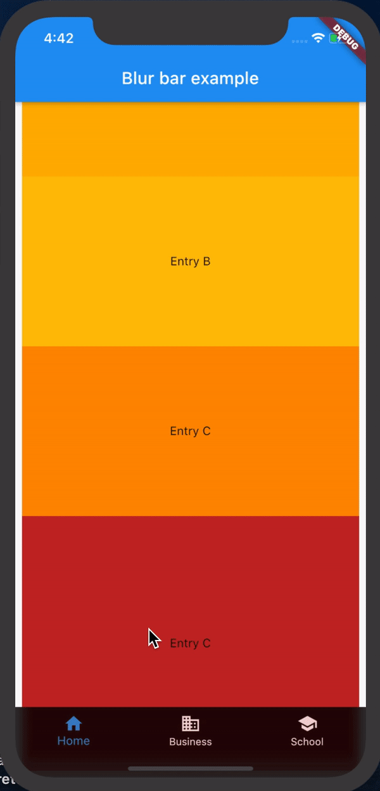
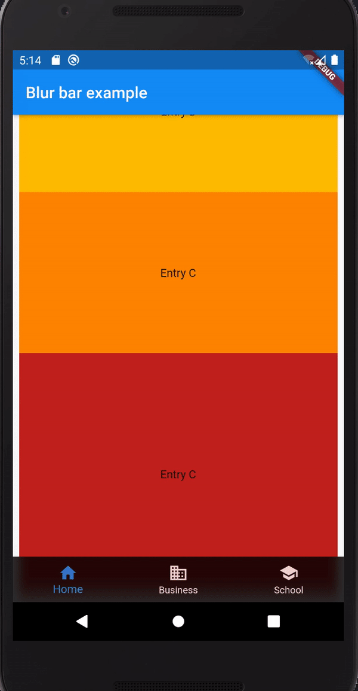

# blur_bottom_bar

Flutter blur bottom bar


This is a recreation of the ios tab view with material design for android and ios

| Preview || Preview |
|---------||---------|
|||


## Getting Started

Add the dependency in `pubspec.yaml`:

```yaml
dependencies:
  ...
  blur_bottom_bar: ^1.0.1
```

## Basic Usage


```dart
return Scaffold(
      appBar: AppBar(title: Text("Blur bar example")),
      body: Stack(
        children: <Widget>[
          _widgetOptions.elementAt(_selectedIndex),
          BlurBottomView(
              bottomNavigationBarItems: const <BottomNavigationBarItem>[
                BottomNavigationBarItem(
                  icon: Icon(Icons.home),
                  title: Text('Home'),
                ),
                BottomNavigationBarItem(
                  icon: Icon(Icons.business),
                  title: Text('Business'),
                ),
                BottomNavigationBarItem(
                  icon: Icon(Icons.school),
                  title: Text('School'),
                )
              ],
              currentIndex: _selectedIndex,
              onIndexChange: (val) {
                _onItemTapped(val);
              }),
        ],
      ),
    );
```
